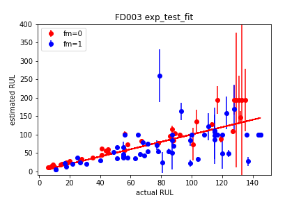

# Predicting_Remaining_Useful_Life_Time-Turbofan_Engines
 NASA Turbofan Jet Engine Data Set, Run to Failure Degradation Simulation

## Predicting remaining usefull life (RUL)

Remaining useful life (RUL) is the time at which a system or a component will no longer perform its intended function. This lack of performance is most often a failure beyond which the system can no longer be used to meet desired performance.

## Data

* The description of the dataset is in the [readme.txt file](readme.txt).
* The data were taken from https://www.kaggle.com/behrad3d/nasa-cmaps 

### Reference for the data

Reference: A. Saxena, K. Goebel, D. Simon, and N. Eklund, Damage Propagation Modeling for Aircraft Engine Run-to-Failure Simulation, in the Proceedings of the 1st International Conference on Prognostics and Health Management (PHM08), Denver CO, Oct 2008.

* Alternatively the dataset can be downloaded from https://ti.arc.nasa.gov/tech/dash/groups/pcoe/prognostic-data-repository/

## Tasks 

- Perform an exploratory analysis of the data.
- Develop a predictive model for the remaining usefull life of the engine and report its accuracy in terms of R-squared and RMSE error.
- Explain your process and chosen model.

--------

# Solution

The analysis is summarized in .ODT document [Analysis_result_report.odt](Analysis_result_report.odt)

General analysis procedure was the following:

1) _Data filtering_

The datasets are showing 21 sensor readings, sri and three operational conditions opj for each trajectory. The data for each trajectory in all datasets were smoothed by exponentially-weighted moving average filter (pandas.DataFrame.ewm) with window size of 10 consecutive sensor readings.

2) _Time reversal_

For the purpose of temporal alignment of the train data, all datasets (both the train and the test) were reversed in time, so that the time in the train dataset is given in RUL units. The RUL information was then added as new feature (column) to the datasets (both train and test).

3) _Scaling_

The sensor readings were of various magnitudes, spanning over 8 orders of magnitude. All sensor readings in all data sets were scaled linearly to show mean value near zero, and near unit variance. Function StandardScaler from sklearn.preprocessing module was used.

After the scaling step, the filtered datasets were saved as .csv files, with the similar naming pattern as the original data, e.g. for original data file train_FD001.txt, the transformed data are in file train_FD001_smooth.csv

The details of the data pre-processing steps 1-3 are in jupyter notebook: [DataFormating.ipnb](DataFormating.ipnb)

4) _Data reduction:_

The filtered datasets were showing large correlation between the individual sri. (Figure 1) Thus they were transformed by principal component analysis (PCA). Four principal components (PC1 through PC4) were used in most cases. It explained more than 97% of the dataset variance. The individual PCs were fitted for each train dataset separately. They were then applied to the corresponding train and test datasets. Thus the PCs were identical for both the train and test parts of each dataset.

The details of each PCA are shown in separate jupyter notebooks, each of which treats a separate dataset.

The operational settings information was left as-received and merged with the transformed sensor readings (PC1..PC4).

## Models

### The exponential fit
Since the data contained exponential evolution of an failure, exponential fit has proven as functional model, especially in the data set FD003: 

### The Recursive Neural Networks (RNNs)
RNN variants were tested: Long-Short Time Memory (LSTM) and Gated Recursive Unit (GRU).

The GRU type of RNN was selected and trained with all the training data in a given dataset. The example test result for FD003 dataset:

_Table: Evaluation of the results:_
* dataset: FD001, model: exponential, 		RMSE = 82.2 cycles, Rsquared = -2.9171
* dataset: FD001, model: GRU25win31_fully, 	RMSE = 54.3 cycles, Rsquared = -0.7102
* dataset: FD002, model: GRU25win21_fully, 	RMSE = 76.6 cycles, Rsquared = -1.0273
* dataset: FD003, model: exponential, 	 	RMSE = 66.9 cycles, Rsquared = -1.6144
* dataset: FD003, model: GRU25win30_fully, 	RMSE = 35.7 cycles, Rsquared = 0.2555
* dataset: FD004, model: GRU25win19_fully, 	RMSE = 61.8 cycles, Rsquared = -0.2866

## Classification of the individual time traces within the datasets

Various failure modes in FD002, FD003 and FD004 were distinguished from the sign of the slope of trajectories of PCs. The meaning of class numbers vary between the datasets. Single failure mode was assumed in datasets FD001, Two modes were assumed in other datasets.

An attempt for classification of the trajectories directly using K-means algorithm (with dynamical time warping of the time series) was performed, but the results were not used, because of high computational resource demands and low accuracy. (present in notebook1)

K-means clustering was used to classify the fault mode in trajectories from FD004 dataset. In this case, the sign of slope factor from linear regression of PC3 was used for classification – naturally, two classes were the result

## Analysis details

Interactive Python is used to analyse data, using jupyter notebook. The scripts in the notebooks depend on external libraries. It was tested for the following versions:

### Requirements:

* python = 3.6.7
* IPython = 7.16.1
* pandas = 1.1.1

* numpy = 1.19.1
* scipy = 1.5.2
* sklearn = 0.23.2
* tslearn = 0.4.1
* tensorflow =  2.1.0

* matplotlib = 3.2.2
* seaborn =  0.11.0

### Datasets treatments:
 
 - The initial data exploration, and filtering is shown in jupyter notebook [DataFormating.ipynb](DataFormating.ipynb).

 - The treatment and prediction results for dataset FD001 is in [FD001_exponential_model.ipynb](FD001_exponential_model.ipynb) and [FD001-RNN_model.ipynb](FD001-RNN_model.ipynb).

 - The dataset FD002 is treated in [FD002-RNN.ipynb](FD002-RNN.ipynb).
 
 - The treatment and prediction results for dataset FD003 is in [FD003-exponential.ipynb](FD003-exponential.ipynb) and [FD003-RNN.ipynb](FD003-RNN.ipynb).

 - The dataset FD004 is treated in [FD004-RNN.ipynb](FD004-RNN.ipynb).
